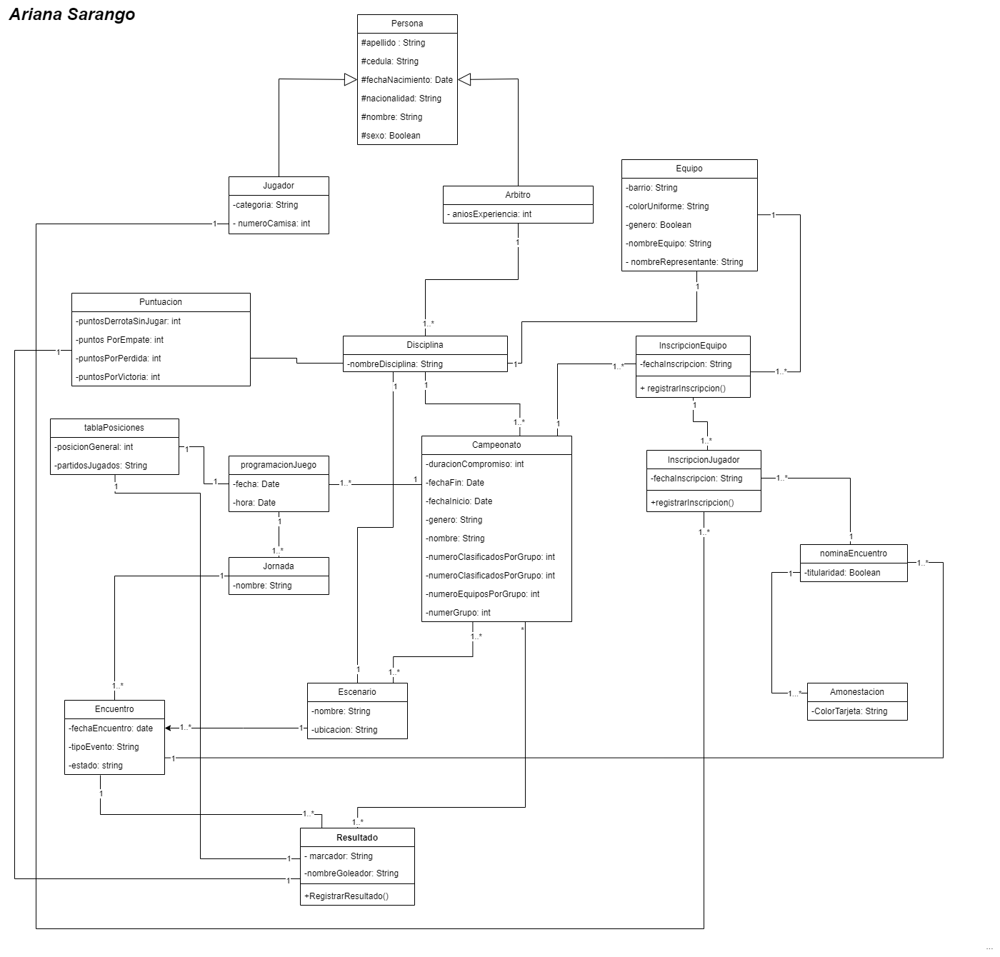

# CampeonatoDeportes

**Integrante:** Ariana Sarango.

**Ciclo:** Segundo "A"

## Instrucciones

1. Clonar el repositorio.
2. Abrir el proyecto clonado en Pycharm.
3. Ubicarse en 'main.py'.
4. Seleccionar 'Run main'.

## Diagrama UML

## Estructura del Proyecto

### Clase: Persona
- **Atributos:**
  - apellido: String
  - cedula: String
  - fechaNacimiento: Date
  - nacionalidad: String
  - nombre: String
  - sexo: Boolean

### Clase: Jugador (hereda de Persona)
- **Atributos:**
  - categoria: String
  - numeroCamisa: int

### Clase: Arbitro (hereda de Persona)
- **Atributos:**
  - aniosExperiencia: int

### Clase: Equipo
- **Atributos:**
  - barrio: String
  - colorUniforme: String
  - genero: Boolean
  - nombreEquipo: String
  - nombreRepresentante: String

### Clase: InscripcionEquipo
- **Atributos:**
  - fechaInscripcion: String
- **Métodos:**
  - registrarInscripcion()

### Clase: InscripcionJugador
- **Atributos:**
  - fechaInscripcion: String
- **Métodos:**
  - registrarInscripcion()

### Clase: Disciplina
- **Atributos:**
  - nombreDisciplina: String

### Clase: Campeonato
- **Atributos:**
  - duracionCompromiso: int
  - fechaFin: Date
  - fechaInicio: Date
  - genero: String
  - nombre: String
  - numeroClasificadosPorGrupo: int
  - numeroEquiposPorGrupo: int
  - numeroGrupo: int

### Clase: Jornada
- **Atributos:**
  - nombre: String

### Clase: Puntuacion
- **Atributos:**
  - puntosDerrotaSinJugar: int
  - puntosEmpate: int
  - puntosPorDerrota: int
  - puntosPorVictoria: int

### Clase: tablaPosiciones
- **Atributos:**
  - posicionGeneral: int
  - partidosJugados: String

### Clase: programacionJuego
- **Atributos:**
  - fecha: Date
  - hora: Date

### Clase: Escenario
- **Atributos:**
  - nombre: String
  - ubicacion: String

### Clase: Encuentro
- **Atributos:**
  - fechaEncuentro: Date
  - tipoEvento: String
  - estado: String

### Clase: Resultado
- **Atributos:**
  - marcador: String
  - nombreGoleador: String
- **Métodos:**
  - RegistrarResultado()

### Clase: Amonestacion
- **Atributos:**
  - colorTarjeta: String

### Clase: nominacionEncuentro
- **Atributos:**
  - titularidad: Boolean
